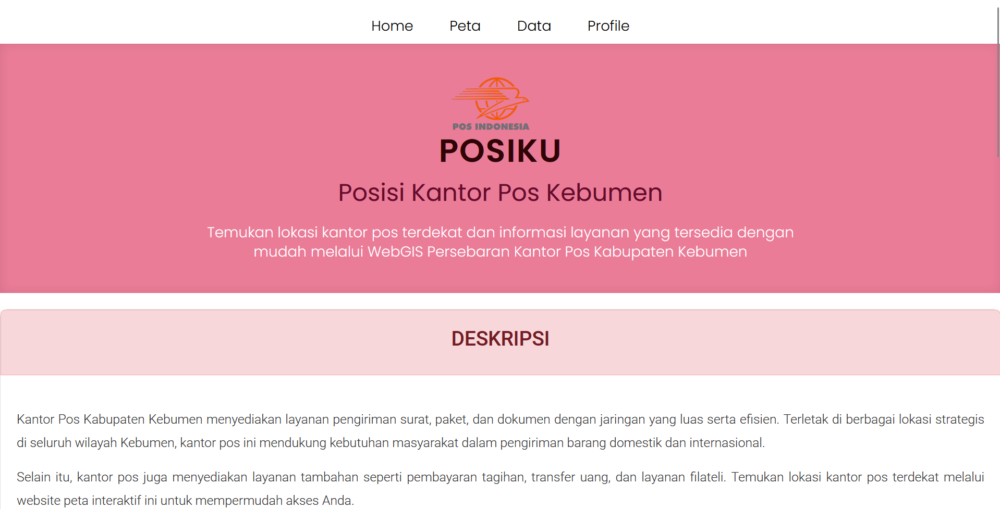
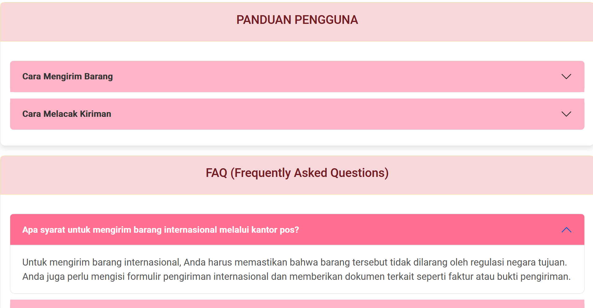
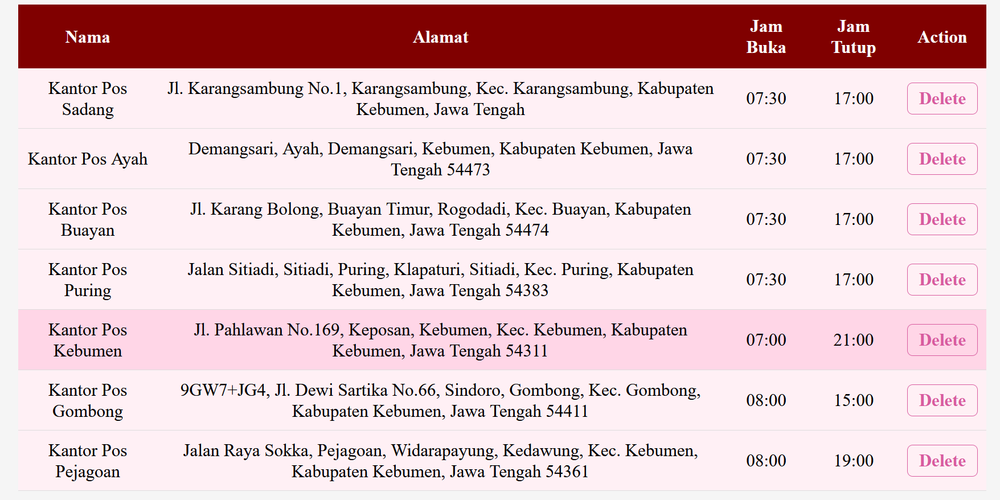
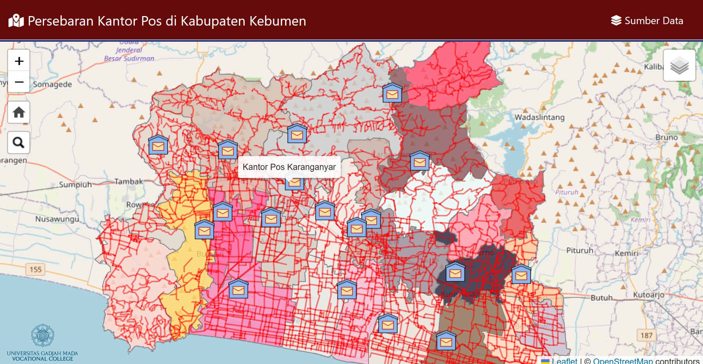

# POSIKU (POSISI KANTOR POS KABUPATEN KEBUMEN)
WebGIS Persebaran Kantor Pos di Kabupaten Kebumen

POSIKU merupakan sebuah WebGIS yang dirancang untuk memetakan lokasi persebaran kantor pos di Kabupaten Kebumen. Website ini akan memudahkan pengguna, baik masyarakat umum maupun pihak terkait, dalam mengetahui lokasi kantor pos beserta informasi detailnya.

## Komponen Pembangun Produk
- **HTML**: Untuk struktur halaman web.
- **CSS**: Untuk desain dan tampilan antarmuka pengguna.
- **Javascript**: Untuk interaktivitas dan fungsionalitas halaman web.
- **Leaflet JS**: Untuk menampilkan peta interaktif dan fitur terkait geospasial.

## Sumber Data
Data lokasi kantor pos diambil dari **Geoportal Indonesia** yang menyediakan data geospasial terkait berbagai lokasi di Indonesia, termasuk kantor pos di Kabupaten Kebumen.

## Tangkapan Layar Komponen Penting Produk

### Landing Page
Landing page akan menampilkan informasi umum mengenai POSIKU serta navigasi yang mudah untuk mengakses peta dan informasi lebih lanjut.

### Elemen Database
Database yang digunakan untuk menyimpan data geospasial kantor pos mencakup informasi seperti alamat, kode pos, dan koordinat geografis yang diambil dari Geoportal Indonesia.

### Peta Digital
Peta digital interaktif menggunakan Leaflet JS yang memungkinkan pengguna untuk melihat dan menjelajahi lokasi kantor pos di Kabupaten Kebumen dengan tampilan peta yang dapat diperbesar, diperkecil, serta memungkinkan pengguna untuk mendapatkan informasi lebih lanjut saat mengklik lokasi kantor pos.

## Profile Pembuat

## Penggunaan
- **Navigasi Peta**: Pengguna dapat menjelajahi peta dan menemukan kantor pos di Kabupaten Kebumen.
- **Pencarian**: Pengguna dapat mencari kantor pos berdasarkan nama atau alamat.
- **Informasi Detail**: Ketika mengklik lokasi kantor pos di peta, informasi lebih lanjut seperti alamat dan kode pos akan ditampilkan.
